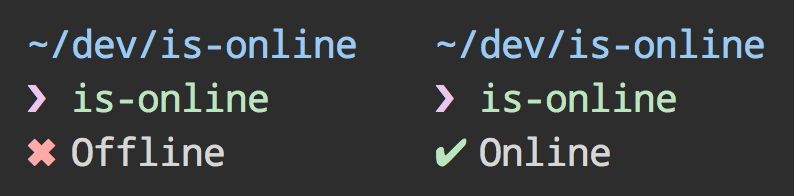

# is-online [](https://travis-ci.org/sindresorhus/is-online)

> Check if the internet connection is up

Works in Node.js, CLI and the browser *(with [browserify](http://browserify.org))*.

In the browser you have [`navigator.onLine`](https://developer.mozilla.org/en-US/docs/Web/API/NavigatorOnLine.onLine), but it's useless as it only tells you if there's a local connection, and not whether the internet is accessible.


## Install

```sh
$ npm install --save is-online
```


## Usage

```js
var isOnline = require('is-online');

isOnline(err, online) {
	console.log(online);
	//=> true
});
```


## Node API

### isOnline(callback)

#### callback(error, online)

*Required*
Type: `function`

`error` is there only by Node.js convention and is always `null`.


## Browser API

### isOnline(callback)

#### callback(online)

*Required*
Type: `function`


## CLI



```sh
$ npm install --global is-online
```

```
$ is-online --help

  Example
    is-online
    ✔︎ Online
```

## How it works
In node, we first contact one of the thirteen [root servers](https://www.iana.org/domains/root/servers) and ask them to direct us the the servers which host the `.com` zone. If they answer us, we return an online status, if no answer is given within one second, we return an offline status. In the rare case where an firewall intercepts the packet and answers it on its behalf, a second check is run which tries to connect to a series of popular web sites on port 80. If one of these connects, we return online, otherwise offline status.

In the browser, a sophisticated like in node is not possible because DNS and socket information is abstracted away by the API. We use a check which requests an uncached `favicon.ico` on a series of popular websites. If one of this checks suceeds, we return online status. If all the requests fail, we return offline status.

## Contributors
* [silverwind](https://github.com/silverwind)

## License

MIT © [Sindre Sorhus](http://sindresorhus.com)
